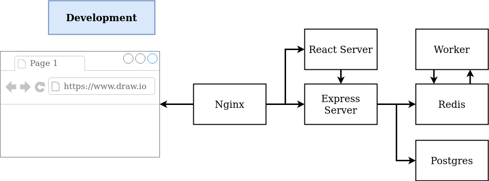

# Building Multi-Container Application

## Containers
- nginx
- redis
- postgres
- react (client)
- express (api server)
- worker (calculator)

## Descriptions
- Browser sends the request to nginx server, which routes the request to respective location
- Frontend is written in React, while Backend is in Nodejs (Express)
- Request coming from browser with '/' path requesting (HTML or JS) is directed to react (client) server located at port 3000.
- Request coming from browser with '/api' path (submitting or retrieving values) is directed to express (api) server located at port 5000
- All the submitted values are stored in postgres database for permanent storage
- All the submitted and calculated values are stored in redis database as key-value pairs
- If the number submitted is previously seen, it will return the calculated value from redis server, otherwise it is sent to worker container for the calculation
- This app is hosted @ localhost:3050

## How to run
    sudo docker-compose up --build

Goto [browser](localhost:3050)

Submit the index/number to get its fibonacci value.

Note: You might have to refresh the page.
